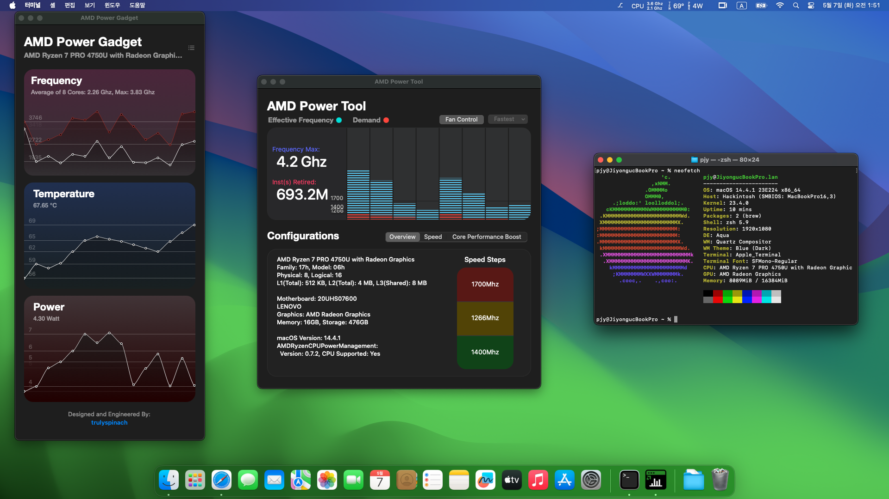

# ThinkPad T14s Gen 1 AMD Hackintosh

## 📝 Specifications

| Component             | Detail                  |
|-----------------------|-------------------------|
| **MacOS Version**     | Sonoma (14.4)           |
| **OpenCore Version**  | 0.99                    |
| **CPU**               | Ryzen 7 Pro 4750U       |
| **GPU**               | Vega 7                  |
| **RAM**               | 16GB                    |
| **Audio Codec**       | ALC257                  |
| **Ethernet Card**     | RTL8111                 |
| **Wifi/BT Card**      | Intel AX200             |
| **Touchpad Devices**  | Synaptics Glass Touchpad|
| **Device**            | Thinkpad T14s Gen 1 AMD |

## 💻 Supported macOS Versions

- **Sonoma**: Fully tested and supported. Improved BT performance compared to Monterey.
- **Ventura**: Potential support, testing not yet concluded.
- **Monterey**: Fully tested and supported.

✅ What's Working

- **Wifi/BT**
- **Trackpad**: Intermittent glass replacement issues.
- **Fan Control**: Full YogaSMC EC Access.
- **Battery Status**
- **IGPU**
- **Backlight**
- **Brightness**
- *...and more!*

❌ Known Issues

- **Airdrop**: Not functioning due to Intel cards not being native, works only on Broadcom cards.
- **Screen Mirroring**: Not available unless using a paid service such as airserver.
- **Sleep**
- **Webcam**
- **Microphone**
- *...and maybe more!*

🛠️ Post Install (Recommended)

After installing macOS, it's recommended to adjust certain settings for optimal performance:

- **iGPU Memory**: Increase the iGPU memory allocation in your BIOS settings to at least 1GB. For better performance with demanding applications, consider setting it to 2GB.
- **YogaSMC app**: Get more control over your system, Fan Control, Backlight, 

⚙️ BIOS Settings (Mandatory)

To ensure your Hackintosh functions correctly, configure the following mandatory BIOS settings:

**Config Tab:**
- Display
  - Boot Display Device -> Thinkpad LCD

**Security Tab:**
- Memory Protection -> Execution Prevention -> On
- Secure Boot -> Off

These settings are crucial for the proper operation of your Hackintosh system.

## 🔑 Important Information

Please note that individual results may vary. The configurations and performance can differ based on your hardware and software environments. Specifically, I have replaced my trackpad with a glass replacement, which may not be the case for your setup. This could lead to differences in trackpad issues and performance. Use this guide as a starting point and tailor the solutions to fit your specific needs.

## 💡 Tips

- For troubleshooting, refer to the `ISSUES` tab.
- Contributions are welcome! See `CONTRIBUTING.md` for how to get started.

## 🤝 Contributions

Feel free to fork, star, and contribute to this project. Every bit of help is appreciated!

## 🙏 Acknowledgements

A shoutout to the Dortania guide and the AMD OSX Discord community for their support. And this would not have been possible without NootedRed!

## ⚠️ Disclaimer

This is a community-driven project for educational purposes. Not affiliated with Lenovo.

## Credits

- **[Apple](https://github.com/apple)**: For macOS.
- **[Dortania Guide](https://dortania.github.io/getting-started/)**: For their invaluable detailed OpenCore guide.
- **[Collin8000](https://github.com/Collin8000/Thinkpad-T14-Gen-1-Amd-Hackintosh)**: For base EFI system (Thinkpad T14 Gen1 AMD)
- **[acidanthera](https://github.com/acidanthera)**: For their OpenCore bootloader and essential kexts that make running macOS on X86 possible.
- **[Baio1977](https://github.com/Baio1977)** and **[Askwakhid](https://github.com/askwakhid)**: For both of their Hackintosh EFI posts about the intel version of the T14. Another thanks to Baio1977 for the bios section of this post
